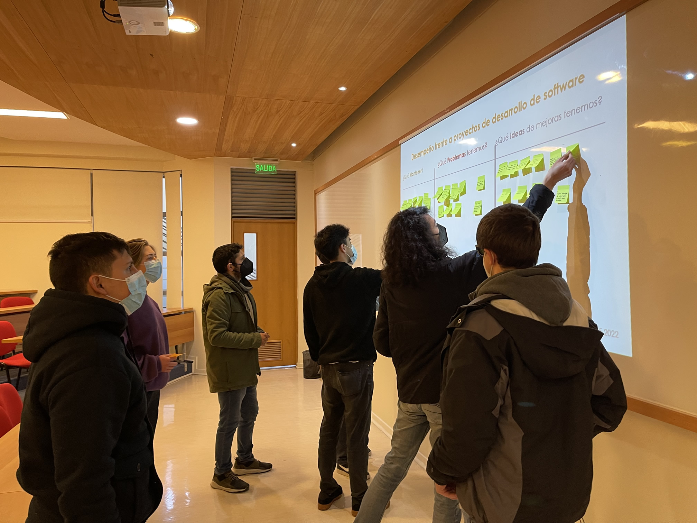

# 📝 Retrospectiva de Sprint Semestre 1 2022

En esta retrospectiva, el equipo analizó los principales aprendizajes y oportunidades de mejora.

---

## ✅ Mantener

### 🧠 Planificación y responsabilidad personal
- Desarrollar un plan personal previo a cada momento de desarrollarlo, diagramas -> P.U.
- Ser responsable con mis tiempos (productividad)
- Mantener la responsabilidad en los horarios de trabajo
- Ser responsables con los tiempos definidos
- Mantener planificación en el desarrollo

### 📝 Documentación y buenas prácticas
- Comentar código y generar documentación básica
- Documentación completa de cada acción tomada programa.
- Leer e interiorizar documentación (proyecto y herramientas)

### 🧑‍💻 Estándares de desarrollo y calidad
- Desarrollar / Escribir código en un estándar en común para que sea entendible por los demás
- Mantener patrones de diseño ordenado
- Testeo de cada uno de mis features

### 🔄 Trabajo colaborativo y herramientas
- Mantener trabajo por ramas y pull request, al trabajar en equipo
- Desarrollo en ramas por separado
- Mantener CI/CD y deploy automáticos
- Reuniones de estado (actualización)
- Creación de lista de trabajo y separación de tareas
- Hablar bastante pronto con compañeros cuando un problema ocurre, para juntos intentar a aprender y resolver el problema

---

## ⚠️ Problemas

### ⌛ Gestión del tiempo y prioridades
- Tiempos de procrastinación y pérdida de tiempo
- Tiempos mal administrados
- Postergar PU hasta que se acumulan
- Priorización poco clara de tareas, tareas no están por escrito
- No se hizo estimación de horas/Puntos por tarea/historia en grupo

### 🔍 Pruebas y calidad del desarrollo
- No hacer pruebas unitarias
- A veces fallan casos críticos en producción
- Centrarse en detalles no especificados que podrían pasar al desarrollo

### 🧩 Metodología y organización
- Falta de orden en ideas sin plasmar en GitHub Projects
- No tengo una metodología de trabajo definida
- Intentar hacer las cosas tal cual se describieron (perfeccionismo) No pensar a veces en flexibilidad

---

## 🚀 Ideas de Mejora

### 📝 Documentación y visibilidad del trabajo
- Implementar diagramas y documentación para cambios.
- Extender documentación a plataforma respectiva, en Confluence por ejemplo
- Documentación de casos de prueba
- Escribir todas las propuestas en GitHub Projects e ir registrándolas ahí para que queden registradas.

### 🧪 Testing y automatización
- Automatizar pruebas
- Escribir más y mejores pruebas unitarias y de sistema
- Preparar y realizar pruebas unitarias desde el inicio

### 📚 Aprendizaje continuo y herramientas
- Dedicar 5-6 horas semanales a estudiar/reforzar tecnologías
- Aprender comandos Git (más de los que sé)

### 🧑‍🤝‍🧑 Organización de equipo
- Registro de horas grupales de trabajo
- Seguir estrategias de organización y cumplir horarios asignados
- Discutir las instrucciones bastante a fondo, antes de empezar a escribir el código, para confirmar que todos tienen la misma visión o percepción del problema

### Estudiantes
- Bruno Prieto
- Cristóbal Bernal
- Siéad Eriksson
- Camilo Villar
- Diego Aguilera
- Javier Torres
- Raúl Álvarez
