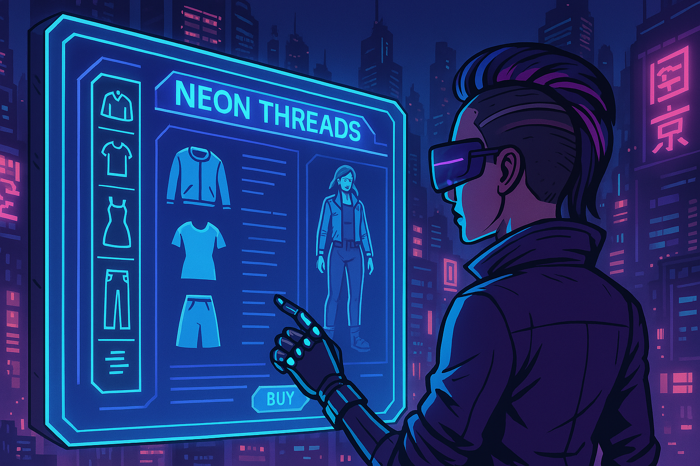

# 🕶️ Caso Ciberpunk: Sistema de Gestión de Moda Virtual "Neon Threads"

## 🧩 El Problema

Es el año **2124**, un futuro donde las megacorporaciones dominan cada aspecto de la vida. *"Neon Threads"* es una tienda virtual especializada en moda para los ciudadanos del **Distrito de la Niebla**, una metrópolis caótica y sobrepoblada, conocida por su cultura de alta tecnología y baja vida.

Los habitantes se visten para impresionar en el **Metaverso**, la única escapatoria de sus monótonas vidas. Sin embargo, muchos clientes han reportado dificultades para encontrar prendas específicas en su estilo. La **gestión manual del inventario virtual** ha llevado a múltiples errores, causando frustración y pérdidas tanto en el mundo real como en el virtual.

Para resolver estos problemas, Neon Threads ha decidido desarrollar un **Sistema de Gestión de Moda Virtual**, que permita a los clientes:

- Navegar por categorías, tipo de ropa, tamaños y colores.
- Ver detalles exhaustivos de cada prenda, incluyendo:
  - Representaciones holográficas.
  - Descripciones detalladas.
  - Precios ajustados al mercado cibernético.

El sistema también contará con una interfaz de administración avanzada para los modistas y gestores de la tienda. Desde ella se podrá:

- Agregar nuevos productos al catálogo.
- Editar detalles existentes.
- Gestionar el inventario en la nube.
- Eliminar elementos no disponibles.

Además, el sistema incluirá:

- Registro y autenticación biométrica.
- Lista de deseos virtual.
- Compras rápidas y seguras dentro del Metaverso.

Este sistema busca no solo mejorar la experiencia de los clientes, sino también optimizar los procesos internos y asegurar el acceso continuo a las últimas tendencias virtuales del Distrito de la Niebla.

---

## 🎯 Misión

Crear una experiencia de compra inmersiva en el Metaverso, brindando a los ciudadanos acceso inmediato y detallado a productos de moda que definan su identidad digital.

---

## 👁️ Visión

Ser el referente líder en moda virtual dentro del Metaverso, proporcionando un entorno que conecte a los ciudadanos con los últimos estilos y tendencias, garantizando la satisfacción del cliente y optimizando la eficiencia operativa en un mundo donde la imagen lo es todo.

---

## 🧭 Principios

- **Excelencia en la experiencia del cliente:** Priorizar la satisfacción y comodidad en cada interacción, ofreciendo un acceso fluido y amigable a la moda virtual.
- **Innovación y adaptabilidad:** Mantenerse a la vanguardia en tecnología de realidad aumentada y tendencias cibernéticas.
- **Integridad y transparencia:** Promover la confianza en un entorno donde la desconfianza es la norma.
- **Colaboración y empoderamiento:** Fomentar la creatividad del equipo como motor de innovación.

---

## 🧪 Requerimientos del Sistema

> ⚠️ Debido a una falla en la matriz de compilación del Metaverso, el sistema deberá ser desarrollado utilizando tecnologías disponibles en el **año 2024**.

### Requerimientos funcionales:

- **Búsqueda Avanzada:** Buscar productos por categoría, tipo de prenda, tamaño y color.
- **Información Detallada:** Mostrar detalles completos de cada artículo (imágenes de alta resolución, descripciones hiperdetalladas, precios).
- **Inventario en Tiempo Real:** Mostrar disponibilidad actualizada de cada producto.
- **Interfaz de Administración:** Agregar, editar y eliminar productos desde una plataforma intuitiva.
- **Registro y Autenticación Biométrica:** Crear cuentas con huella digital o escáner de retina (también se permite login clásico con usuario y contraseña).
- **Gestión de Compras:** Carro de compras, revisión de selección y finalización de transacción eficiente.
- **Seguridad de Datos:** Protección de datos personales y financieros mediante ciberseguridad avanzada.
- **Análisis y Reporting Cibernético:** Generar reportes con métricas y tendencias para la toma de decisiones.

---

