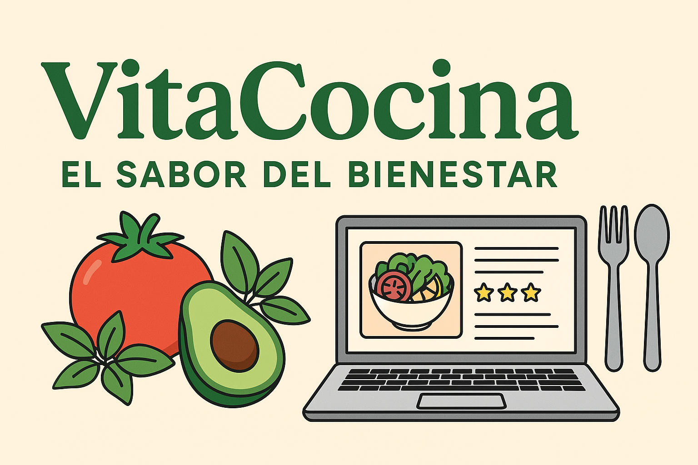

# 🥗 Caso Plataforma Web "VitaCocina – El Sabor del Bienestar"

## 🧩 El Problema

**VitaCocina** es un restaurante conocido por su enfoque en la alimentación saludable y sabrosa, atrayendo a una clientela preocupada por su bienestar. Sin embargo, muchos clientes tienen dificultades para replicar en casa las recetas que disfrutan en el local.

Algunos no saben por dónde empezar, otros desean adaptar las recetas a sus necesidades alimenticias o preferencias personales. Esto ha generado una necesidad de extender el impacto del restaurante **más allá del salón**, facilitando una experiencia de cocina saludable desde casa.

Para ello, se propone el desarrollo de **"VitaCocina: El Sabor del Bienestar"**, un portal web con recetas saludables, consejos culinarios y herramientas para planificar una alimentación equilibrada, adaptada a cada usuario.

---

## 🎯 Misión

Inspirar y empoderar a las personas para adoptar un estilo de vida saludable, brindando acceso a recetas nutritivas, sabrosas y prácticas, junto con consejos que puedan aplicar fácilmente en su día a día.

---

## 👁️ Visión

Convertirse en el recurso digital de referencia para quienes buscan mejorar su alimentación, combinando bienestar y sabor mediante contenido accesible, de calidad y adaptable.

---

## 🧭 Principios

- **Atención al cliente:** Brindar información clara, útil y accesible para cocinar con tranquilidad y confianza.
- **Excelencia profesional:** Trabajar con chefs calificados que usan ingredientes frescos y técnicas saludables.
- **Innovación:** Usar tecnología moderna para conectar recetas, consejos y herramientas en una experiencia digital amigable.
- **Responsabilidad social:** Promover hábitos de alimentación sostenibles, diversos y personalizados.

---

## 🧪 Requerimientos del Sistema

### Requerimientos funcionales:

- **Búsqueda avanzada de recetas:** Filtrar por tipo de comida, dieta, tiempo de preparación o nivel de dificultad.
- **Recetas con información detallada:** Ingredientes, pasos, valor nutricional, fotos y videos.
- **Comentarios y valoraciones:** Los usuarios pueden opinar y evaluar las recetas.
- **Compartir en redes sociales:** Tanto recetas como consejos pueden ser publicados fácilmente.
- **Interfaz administrativa:** Gestión eficiente de recetas, consejos y usuarios por parte del equipo de VitaCocina.
- **Registro de usuarios:** Los usuarios pueden guardar favoritos, publicar recetas propias y acceder a funcionalidades personalizadas.
- **Planificación de comidas:** Crear planes semanales y listas de compras automáticas.
- **Consejos culinarios específicos:** Sugerencias contextuales para cada receta (por ejemplo: cómo reemplazar ingredientes o técnicas útiles).

---

