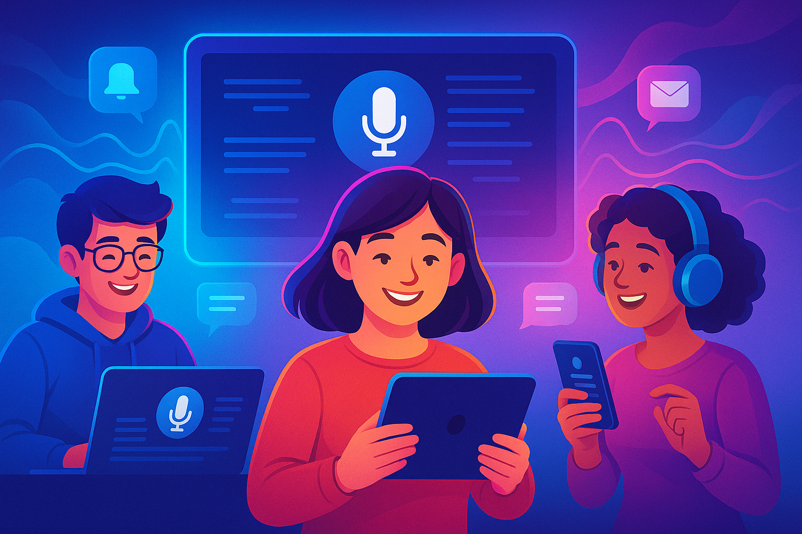

# 🎙️ Speech2Text X – Solución definitiva para transcripción de audios

## ❌ El Problema
Hoy en día existen múltiples soluciones para transcribir audios, pero la mayoría presentan problemas:

- Costos elevados por minuto de transcripción o planes restrictivos.  
- Plataformas cerradas sin posibilidad de compartir fácilmente el resultado.  
- Tiempos de espera poco claros: el usuario no sabe cuándo estará lista su transcripción.  
- Dificultades para distribuir: compartir requiere procesos manuales poco prácticos.  
- Falta de funciones avanzadas como **diarización de hablantes** o **resúmenes automáticos**.  

Esto afecta a estudiantes, periodistas, investigadores y profesionales que pierden tiempo y dinero en procesos fragmentados, sin un portal único, simple y accesible.

---

## 💡 La Solución
**Speech2Text X** será un **portal universal y colaborativo** para transcribir audios, con foco en accesibilidad y costo cero (o mínimo).

### Funcionalidades principales
- **Carga de audios** en múltiples formatos (mp3, wav, m4a, ogg).  
- **Transcripción automática** con IA de última generación.  
- **Diarización**: identificación de distintos hablantes.  
- **Notificación de finalización**: aviso por email o WhatsApp si la transcripción demora.  
- **Compartir en un clic**: enlaces públicos/privados para distribuir por email o WhatsApp.  
- **ChatIA integrado**: generar resúmenes, ideas principales y extractos automáticos.  
- **Panel personal**: historial de transcripciones, búsquedas y gestión de accesos compartidos.

---

## 🎯 Misión
Crear un portal **abierto, simple y accesible** que democratice el acceso a la transcripción automática de audios, reduciendo las barreras de costo y complejidad tecnológica.

---

## 🌟 Visión
Convertirse en la **plataforma universal de transcripciones colaborativas**, donde cualquier persona pueda convertir audios en conocimiento estructurado y compartible.

---

## 🔑 Principios
- **Accesibilidad**: costo cero o mínimo.  
- **Colaboración**: compartir transcripciones en un clic.  
- **Inteligencia**: IA no solo para transcribir, sino para **resumir y sintetizar**.  
- **Eficiencia**: notificaciones y procesos asincrónicos.  
- **Seguridad y privacidad**: control de accesos y datos protegidos.

---

## 🛠️ Requerimientos del Sistema

### 👥 Gestión de usuarios
- Registro/login con email o redes sociales.  
- Roles: usuario básico y administrador.

### 📂 Transcripciones
- Carga de audio en formatos comunes.  
- Procesamiento con **IA de transcripción**.  
- Diarización automática de hablantes.  
- Historial consultable con buscador.

### 🔔 Notificaciones
- Aviso por email/WhatsApp cuando la transcripción esté lista.  
- Confirmación al compartir.

### 📤 Compartir y colaboración
- Enlaces públicos/privados en un clic.  
- Envío directo por email o WhatsApp.  
- Opciones de edición colaborativa.

### 💬 ChatIA
- Resúmenes automáticos.  
- Extracción de ideas principales.  
- Conversación interactiva sobre el contenido.

### 📊 Panel de control
- Visualización de transcripciones.  
- Filtros por fecha, etiquetas y tipo de audio.  
- Métricas de uso (audios, duración, palabras procesadas).

### 🔒 Seguridad
- HTTPS, contraseñas cifradas, permisos en enlaces compartidos.  
- Borrado seguro de transcripciones.

> Ayuda: Usar Whisper
  
  ---
