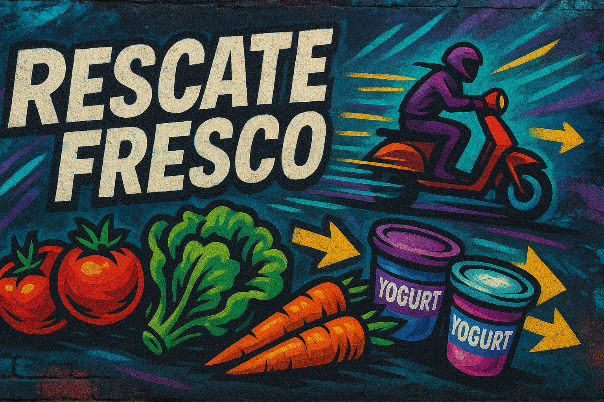

# 🥕 Rescate Fresco: Marketplace de productos “próximos a vencer” o imperfectos

## ❌ El Problema
- Mucho producto queda **cerca de su fecha de vencimiento** o con **defectos estéticos** y termina como merma.  
- Tiendas pequeñas no tienen un **canal digital simple** para publicar remates rápidos.  
- Los clientes no se enteran a tiempo de las ofertas; falta **alerta de última hora** y reserva en 1–2 clics.  
- Falta **trazabilidad** del impacto (kg rescatados) y métricas simples para demostrar valor.

---

## 💡 La Solución
**FarmLink Deals** es un **marketplace liviano** donde las tiendas publican “lotes de rescate” y los consumidores **reservan y retiran** en horarios definidos.

- Publicación rápida de lotes con **vencimiento**, **precio de rescate** y **fotos**.  
- **Reserva express** con ventana de retiro.
- **Alertas** de “última hora” y **recomendaciones (IA opcional)** según preferencias.  
- **KPIs** para tiendas (kg rescatados, % merma evitada) y para clientes (ahorro).

---

## 🎯 Misión
Reducir la merma en comercios locales y democratizar el acceso a alimentos más baratos, con una experiencia simple, medible y colaborativa.

## 🌟 Visión
Ser la **app de referencia** para rescatar alimentos en la última milla, conectando tiendas de barrio con comunidades cercanas.

## 🔑 Principios
- ♻️ **Impacto**: priorizar kg rescatados y % merma evitada.  
- 🪶 **Simplicidad**: publicar, reservar y retirar en pocos clics.  
- 🧭 **Transparencia**: reglas claras de reserva/retiro y estado de cada lote.  
- 🔐 **Confianza**: trazabilidad y auditoría de cambios.

---

## 👥 Roles y Permisos (RBAC simple)
- **Tienda**: publica/edita lotes, confirma retiro, gestiona stock, ve KPIs.  
- **Consumidor**: busca, filtra, reserva, paga (modo dev), comparte, recibe alertas, ve ahorro.  
- **Admin**: modera contenidos, gestiona categorías y reglas globales.

---

## 🧩 Funcionalidades (alcance s2)
### Para la **Tienda**
- **Publicar lote**: nombre, categoría, descripción breve, **peso/qty**, **precio original y de rescate**, **fecha/hora de vencimiento**, **ventana de retiro**, ubicación, fotos.  
- **Validaciones**: stock > 0, vencimiento > ahora, precioRescate < precioOriginal.  
- **Estados del lote**: `PUBLICADO → RESERVADO → RETIRADO` (o `CADUCADO/CANCELADO`).  
- **Confirmación de retiro**: con **QR one‑time** o **PIN** (marca reserva como *RETIRADA*).  
- **Panel**: kg rescatados, % merma evitada, ingresos por rescate, top categorías.

### Para el **Consumidor**
- **Explorar & filtrar**: por cercanía, categoría, rango de precio, “vence antes de X”.  
- **Reserva express** (hold 15–30 min) con **ventana de retiro** clara (p.ej. 17:00–19:00).  
- **Pago en modo desarrollo** (ver sección de pagos).  
- **Mis reservas**: estado, QR, instrucciones de retiro; cancelación con política simple.  
- **Notificaciones**: “última hora” (p.ej., 90/30/10 min antes del vencimiento).  
- **Recomendaciones (IA opcional)**: historial/preferencias (vegetariano, lácteos, sin gluten, distancia).

### Compartir & Viralización
- 🔗 **Enlaces compartibles** a un lote o a “ofertas cerca de mí”.  
- 🗺️ Mapa simple con las tiendas participantes y su horario de retiro.

---

## 💳 Integración de **Pagos vía API** (modo desarrollo)
> Integrar **una pasarela en sandbox/test**, sin dinero real, con **webhooks** y **estados de pago**, en modo desarrollo

### Proveedores **sugeridos** (todos con modo prueba)
- **Stripe** (test keys, Webhooks).  
- **Mercado Pago** (sandbox).  
- **PayPal** (Sandbox).  
- **Transbank Webpay** (Chile – ambiente de certificación).  
- **Flow.cl** (sandbox).  
- **Khipu** (sandbox).  
- **Fintoc** *(si optan por open finance/validación de cuenta o inicio de transferencias, revisar disponibilidad de sandbox/documentación)*.

> Nota: **elige uno** y documenta credenciales de prueba y pasos (sin exponer secretos).

---

## 📊 KPIs & Métricas
- **Tiendas**: kg rescatados, **% merma evitada**, tasa de retiro (reservas → retiradas), ingresos por rescate, “tiempo promedio de venta” por lote.  
- **Consumidores**: **$ ahorrados**, lotes retirados, categorías favoritas.  
- **Plataforma**: throughput de lotes (publicados→retirados), cancelaciones, caducados.

---

## 🧠 IA (opcional)
- **Recomendación**: “Te puede interesar este pack de frutas imperfectas a 6 cuadras”.  
- **Re‑pricing ligero**: sugerencia de precio dinámico cerca del vencimiento (tienda decide).  
- **Clasificación automática** de categoría desde título/foto (baseline).

---
