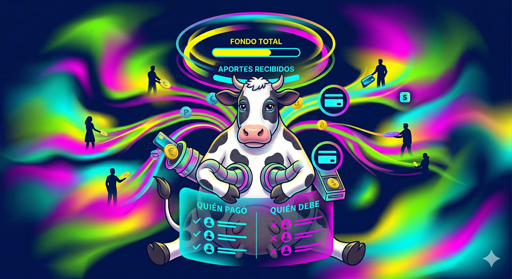

# 🪙 VaquitaApp: Juntas y Fondos Colectivos Digitales

## 🧩 El Problema

En muchos grupos de amigos, cursos, familias, equipos de trabajo y comunidades, es común organizar fondos colectivos para reunir dinero con un objetivo compartido. Esto ocurre, por ejemplo, en regalos grupales, actividades, paseos, cuotas de curso, rifas, convivencias, materiales, eventos o pagos periódicos dentro de colegios y otras organizaciones.

Sin embargo, estos procesos suelen gestionarse de forma manual, usando grupos de WhatsApp, transferencias separadas y registros en papel o planillas. Esto genera desorden, olvidos, falta de visibilidad sobre quién pagó, errores en los montos y desconfianza entre los participantes.

Además, la persona que organiza normalmente asume toda la carga de coordinación y control, sin contar con herramientas simples para hacer seguimiento o transparentar el estado del fondo.

> Se necesita una plataforma que permita administrar fondos colectivos de forma clara, ordenada y accesible para todos los participantes.

---

## 💡 La Solución

**VaquitaApp** será una plataforma web donde una persona organizadora podrá crear un fondo colectivo, invitar participantes y definir reglas básicas como monto esperado, frecuencia de aporte y objetivo del fondo.

Cada participante podrá revisar su estado de aportes y el avance general en tiempo real. La plataforma podrá registrar pagos, saldos pendientes y movimientos asociados al fondo.

La solución también podrá aplicarse a contextos más formales, como cursos de colegios, centros de padres, talleres, comunidades u otras organizaciones que necesiten administrar cuotas o fondos comunes con mayor transparencia.

Además, el sistema podrá incorporar funcionalidades apoyadas por inteligencia artificial, como alertas predictivas sobre participantes morosos y resúmenes automáticos del estado del fondo. El flujo de pagos podrá resolverse mediante saldo virtual, simulación o integración con Stripe.

La idea queda abierta para que el equipo refine reglas, flujos y funcionalidades complementarias.

---

## 🎯 Misión

Facilitar la organización y gestión de fondos colectivos mediante una plataforma simple, transparente y confiable.

---

## 🌍 Visión

Ser una solución digital de referencia para administrar juntas, cuotas y fondos compartidos entre personas, cursos y organizaciones.

---

## ⭐ Principios

- **Transparencia:** cada participante debe poder revisar el estado del fondo.
- **Simplicidad:** el uso de la plataforma debe ser claro y directo.
- **Confianza:** los aportes y movimientos deben quedar registrados.
- **Flexibilidad:** el sistema debe adaptarse a distintos contextos y tipos de fondo.

---

## 🛠️ Requerimientos del Sistema

- Registro e inicio de sesión de usuarios.
- Creación de fondos colectivos.
- Invitación y gestión de participantes.
- Definición de datos básicos del fondo, por ejemplo:
  - Nombre
  - Descripción
  - Objetivo
  - Monto esperado
  - Frecuencia de aporte
  - Fecha límite
- Visualización del estado general del fondo.
- Registro de aportes realizados por participantes.
- Visualización de participantes al día y pendientes.
- Historial de movimientos del fondo.
- Panel del organizador para administrar participantes, aportes y estado del fondo.
- Perfil de usuario con historial de participación en fondos.
- Notificaciones o recordatorios de pago.
- Posible integración con Stripe, o simulación coherente del proceso de cobro.
- Soporte para contextos como cursos de colegios u otras organizaciones.
- Diseño responsive.
- Persistencia de datos.

---

## 🔓 Aspectos Abiertos para el Equipo

El equipo podrá definir o ampliar aspectos como:

- Tipos de fondos permitidos.
- Reglas de cobro y vencimiento.
- Manejo de morosidad.
- Resúmenes automáticos con IA.
- Alertas predictivas.
- Reglas de cierre del fondo.
- Reportes, comprobantes o exportación.
- Roles adicionales dentro de organizaciones.

---

## 👥 Autor

- Equipo docente / adaptación basada en idea de proyecto para HandsOnProject 2026
"""
