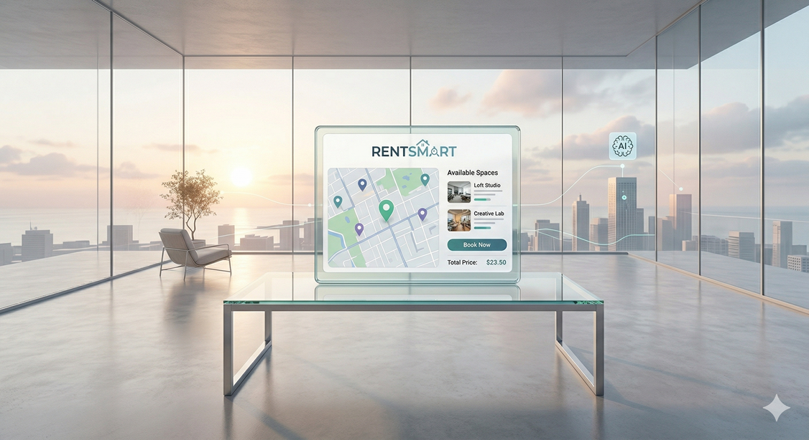

# RentSmart: Arriendo de Espacios entre Particulares 

## El Problema

En muchas ciudades, arrendar espacios por horas o por días entre particulares sigue siendo un proceso poco estandarizado y difícil de gestionar. Encontrar una sala de reuniones, una cancha, un estudio fotográfico, una cocina compartida u otro espacio similar suele implicar búsquedas informales en redes sociales, recomendaciones, mensajes por WhatsApp o llamadas directas.

Este proceso presenta varios inconvenientes: poca visibilidad de la oferta disponible, dificultad para comparar precios y condiciones, coordinación manual de horarios, pagos realizados fuera de una plataforma formal y baja confianza entre las partes. Además, muchas veces no existe claridad sobre la disponibilidad real del espacio, las reglas de uso, ni mecanismos simples para confirmar una reserva.

Por otro lado, quienes poseen espacios disponibles no siempre cuentan con una vitrina digital sencilla para publicarlos, administrarlos y recibir pagos de forma ordenada. Esto limita el uso eficiente de espacios que podrían ser aprovechados por otras personas o pequeños emprendimientos.

> Este escenario genera fricción, desconfianza y pérdida de tiempo tanto para quienes buscan un lugar como para quienes desean arrendarlo. Frente a esto, un equipo de desarrollo ha sido contratado para crear una aplicación web que facilite la publicación, búsqueda, reserva y pago de espacios entre particulares.

* * *

## La Solución

RentSmart será una aplicación web que permitirá conectar a propietarios de espacios con personas interesadas en arrendarlos de manera simple, segura y centralizada.

La plataforma permitirá que cada propietario publique uno o más espacios, incorporando información como nombre, tipo de espacio, ubicación referencial, fotos, precio por hora o por día, disponibilidad y condiciones de uso. A partir de fotos y datos básicos, la plataforma podrá apoyarse en inteligencia artificial para proponer una descripción inicial del espacio, la cual podrá ser editada posteriormente por el propietario.

Por su parte, los usuarios podrán explorar los espacios publicados, filtrarlos por distintos criterios y realizar solicitudes o reservas directamente desde la plataforma. El sistema podrá incorporar pago en línea mediante [Stripe](https://stripe.com/es-us), permitiendo registrar el cobro de una reserva y eventualmente aplicar una comisión por uso de la plataforma.

RentSmart también podrá incluir capacidades de búsqueda más avanzadas, permitiendo que un usuario describa en lenguaje natural qué tipo de actividad desea realizar, para que el sistema sugiera espacios adecuados según ese contexto. Por ejemplo, una persona podría buscar algo como: “necesito un lugar tranquilo para una reunión de 8 personas” o “busco una cocina equipada para un taller pequeño”.

La solución deberá quedar lo suficientemente abierta para que el equipo de estudiantes defina y refine aspectos relevantes del producto, tales como:
- Tipos exactos de espacios que estarán permitidos.
- Reglas de publicación y validación.
- Flujo definitivo de reserva.
- Sistema de reputación, comentarios o calificaciones.
- Pago
- Alcance real del uso de inteligencia artificial en el producto.

* * *

## Misión

Facilitar el arriendo de espacios entre particulares mediante una plataforma digital simple, confiable y accesible, que reduzca la fricción del proceso de búsqueda, coordinación, reserva y pago.

* * *

## Visión

Ser una plataforma referente en la gestión digital de arriendo flexible de espacios entre personas, promoviendo un uso más eficiente de la infraestructura disponible y mejorando la experiencia tanto de propietarios como de arrendatarios.

* * *

## Principios

- ✅ **Simplicidad:** El sistema debe ser fácil de usar tanto para quienes publican espacios como para quienes reservan.
- 🔒 **Confianza:** La plataforma debe favorecer interacciones seguras, claras y trazables entre las partes.
- ⚙️ **Flexibilidad:** La solución debe permitir evolucionar reglas de negocio y funcionalidades según el aprendizaje del producto.
- 🤝 **Transparencia:** La información relevante de cada espacio, reserva y pago debe estar visible y ser comprensible.
- 🚀 **Escalabilidad:** El producto debe poder crecer en cantidad de usuarios, espacios y tipos de uso sin rediseños mayores.

* * *

## Requerimientos del Sistema

- Registro e inicio de sesión para usuarios de la plataforma.
- Posibilidad de distinguir, al menos, entre usuarios que publican espacios y usuarios que los reservan.
- Publicación de espacios con información básica:
  - Nombre del espacio.
  - Descripción.
  - Tipo de espacio.
  - Fotografías.
  - Precio por hora y/o por día.
  - Ubicación referencial.
  - Reglas o condiciones de uso.
- Edición, activación y desactivación de publicaciones.
- Visualización de espacios disponibles en un catálogo o listado.
- Búsqueda, ordenamiento y filtros por distintos criterios, por ejemplo:
  - Tipo de espacio.
  - Precio.
  - Ubicación.
  - Disponibilidad.
  - Capacidad.
- Visualización del detalle de cada espacio.
- Gestión de disponibilidad del espacio mediante algún mecanismo definido por el equipo.
- Creación y gestión de reservas.
- Integración de pagos en línea mediante Stripe, o al menos simulación coherente del flujo de pago.
- Registro del estado de una reserva, por ejemplo:
  - Pendiente.
  - Confirmada.
  - Pagada.
  - Cancelada.
  - Finalizada.
- Panel o vista para que el propietario pueda revisar sus espacios y reservas.
- Panel o vista para que el usuario pueda revisar sus búsquedas, reservas o pagos.
- Uso de inteligencia artificial para apoyar al menos una funcionalidad del sistema, por ejemplo:
  - Generación de descripción automática del espacio.
  - Recomendación de espacios según una necesidad expresada en lenguaje natural.
  - Etiquetado o categorización automática.
- Validaciones de negocio definidas por el equipo, tales como:
  - Evitar reservas en horarios no disponibles.
  - Restringir publicaciones incompletas.
  - Controlar conflictos de agenda.
- Diseño responsive.
- Persistencia de datos en una base de datos.
- Panel administrativo básico o capacidades de administración del sistema.
- El equipo podrá definir requerimientos adicionales que agreguen valor al producto, siempre que sean coherentes con la idea base.

## Consideraciones Abiertas para el Equipo

El proyecto debe entenderse como una base inicial de producto, incompleta, no como una especificación cerrada, se pueden hacer supuesto y consultas al profesor. Por lo tanto, el equipo de estudiantes podrá profundizar y completar aspectos como:

- Modelo de negocio exacto de la plataforma.
- Alcance del cobro de comisión.
- Reglas de cancelación y devolución.
- Verificación de identidad o confianza entre usuarios.
- Sistema de reseñas o reputación.
- Manejo de conflictos o reclamos.
- Alcance móvil, web o ambos.
- Restricciones por tipo de espacio.
- Funcionalidades premium o futuras extensiones.

## Autor

- Equipo docente / adaptación basada en idea de proyecto para HandsOnProject
  semestre 2 2026
